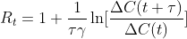
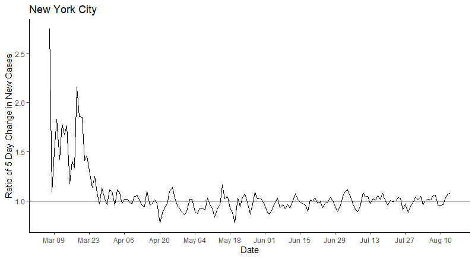
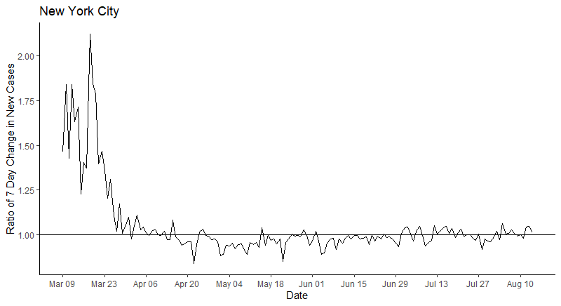

# Simple ratio plot to assess epidemic trends

In the original report (Yu X. AJE, 2020), based on the association between R_t and changes of new cases between two intervals: 

I proposed to plot the ratio of new cases between 2 consecutive intervals (t, t-τ) and (t, t+τ) against time to indirectly examine the change of effective reproductive number over time during the epidemic. A simple choice of τ is 1, as used in the original report. In addition, smoothing the changes of new cases is preferred. Since the infectious period between two generations of cases in COVID-19 is about 3-7 days on average, smoothing over 3 to 7 days seems reasonable and smoothing can be achieved satisfactorily with a backward 3-day moving summation.  In the examples presented in the paper, I used a 5-day moving average between two consecutive periods to account for a typical generational period of 5 days.  However, given the typical weekend under-reporting followed by catching up reporting in Mondays, a 7-day interval averaging may be more appropriate.  

In the R example codes, we will plot both ratio of consecutive 5-day average and ratio of consecutive 7-day average against time for New York City. 

Reference:
Yu X. Assessing Epidemic Trends in Real Time with a Simple Ratio Plot. AJE, 2020 (in press). https://academic.oup.com/aje/advance-article-abstract/doi/10.1093/aje/kwaa123/5864525

Examples: Ratio Plots for New York City

